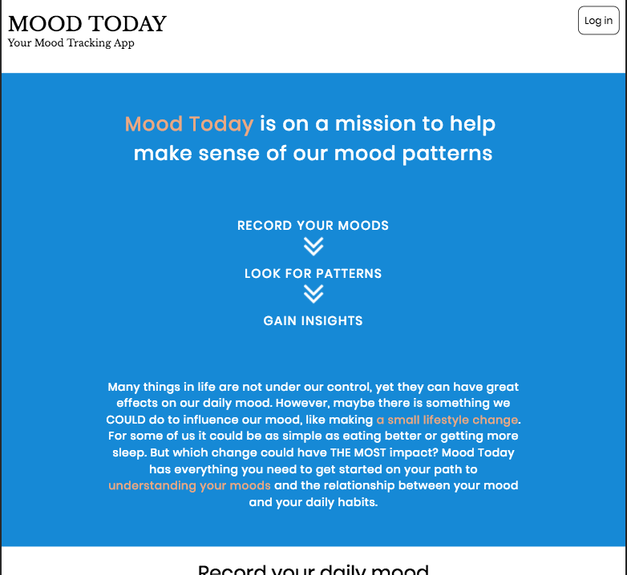
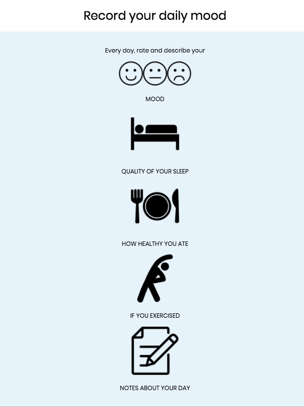
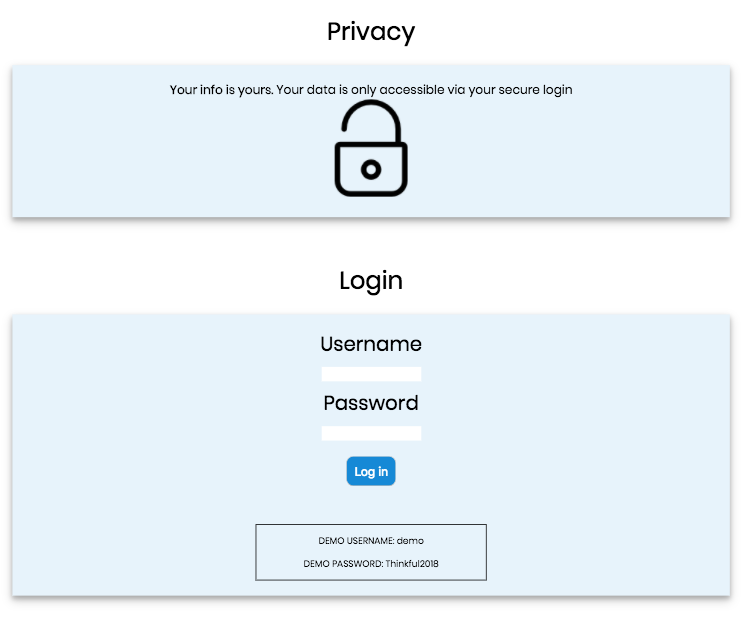
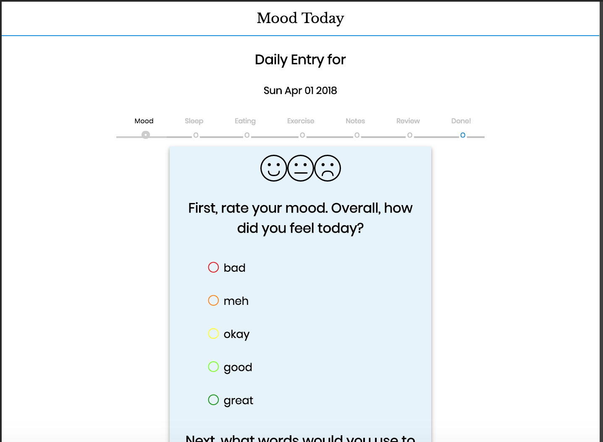
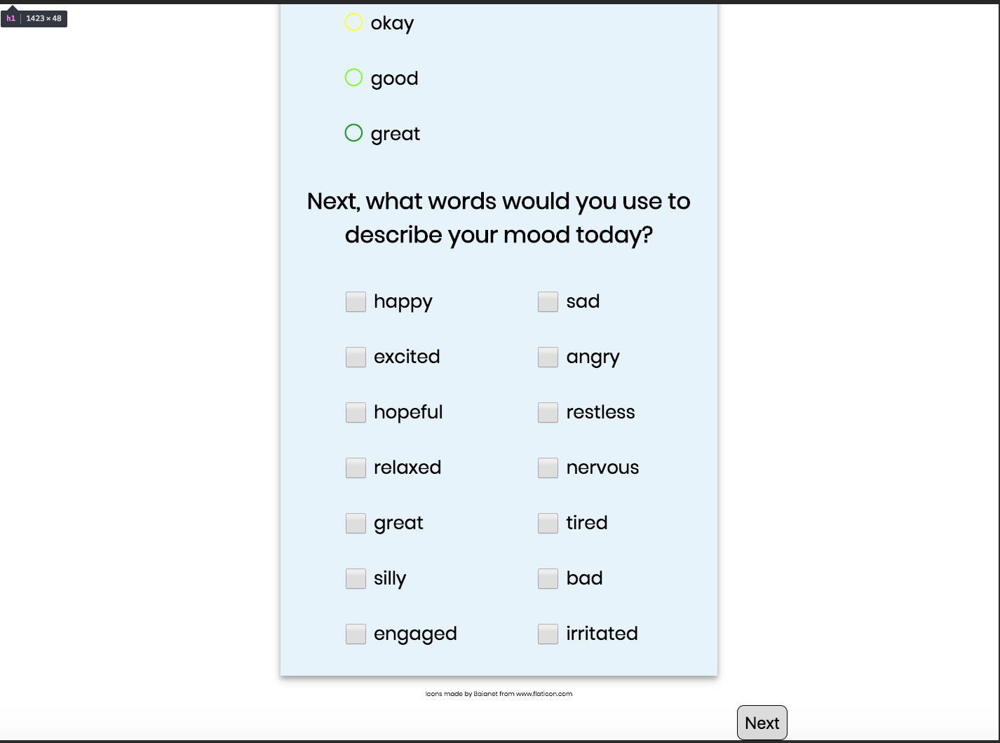
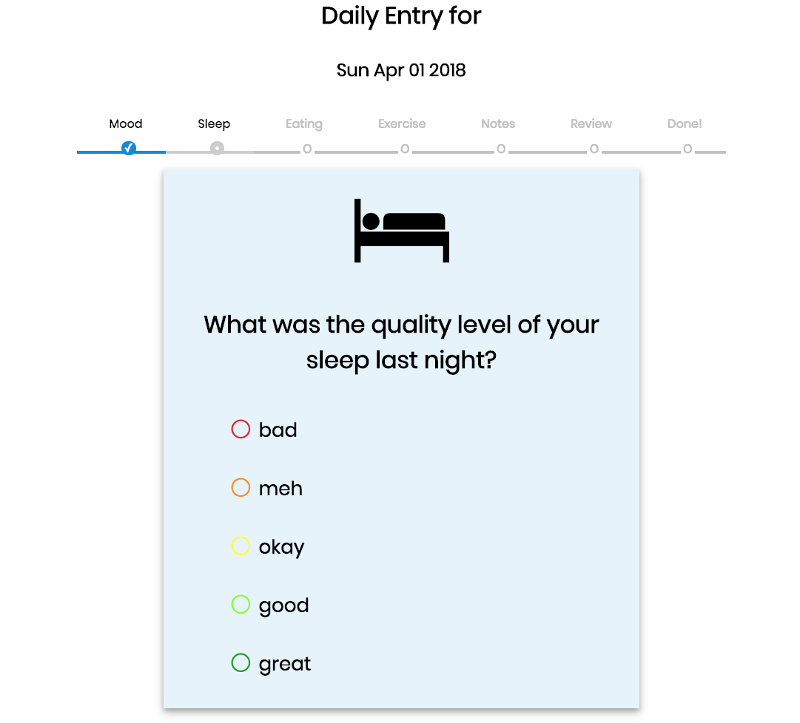
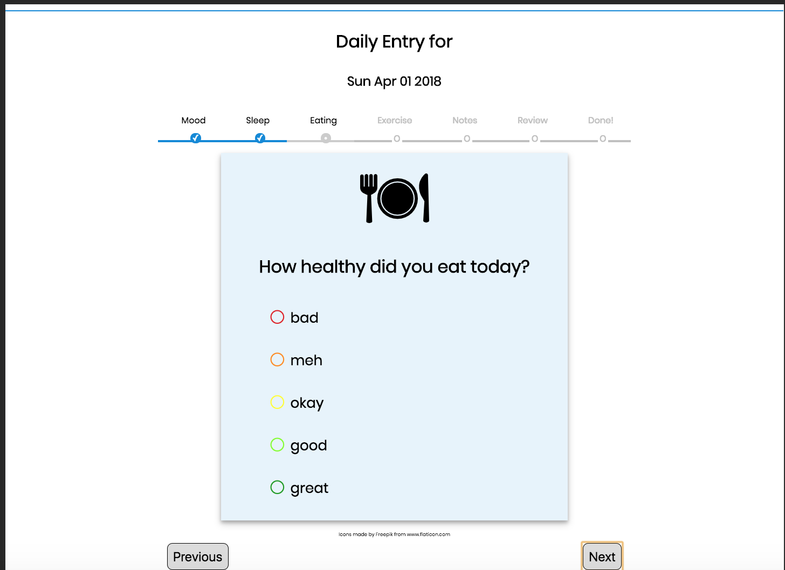
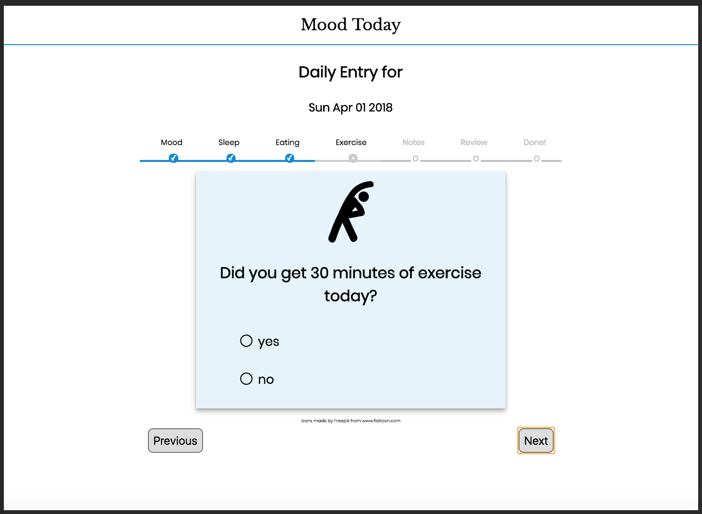
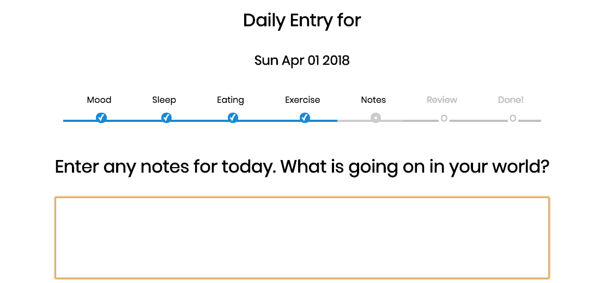
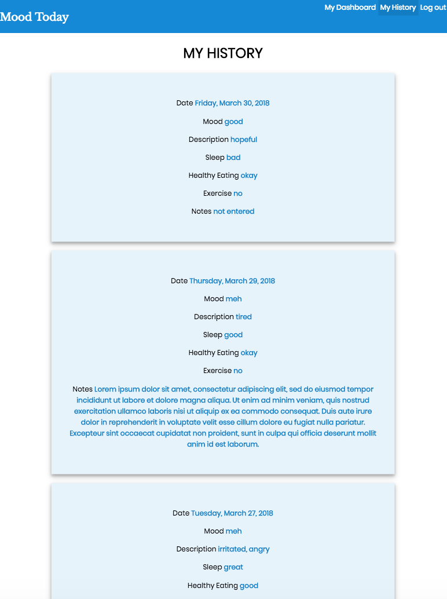

MOOD TODAY

https://laughing-snyder-8c7a23.netlify.com/

### MOOD TODAY is a mood-tracking app. Every day you can rate your mood, along with other factors such as sleep, healthy eating, and exercise, to build up a ### database of your mood data over time.

### You can then review your mood history as well as see charts and graphs that can help you analyze your data, look for patterns, and gain insights.
### A user's data can only be accessed via secure login

### The user can rate their mood on a scale of 1 (bad) to 5 (great)

### The user can also choose from a list of words to describe their mood (happy, sad, etc)

## The same 1-5 scale is used to rate the quality of your sleep...

### ...and how healthy you ate

### The user can also record if they got some exercise

### Finally, there is a Notes page to record free-form text about your day

### There is a History page where the user can view all of their entries.

### Finally, there is a Dashboard page where the user can view charts and graphs based on their accumulated data.

### Technology stack

Front-End
+ React
+ Redux
+ HTML
+ CSS
+ JavaScript/JSX

Back-end
+ Node.js
+ Express.js
+ Mongoose
+ MongoDB

Testing
+ Mocha
+ Chai
+ Enzyme

Other
+ Git and Github
+ Netlify
+ Heroku
+ mLab
+ Travis CI
+ Moment.js
+ Victory
+ React-Stepzilla
+ JSON Web Token
+ CORS
+ FontAwesome
