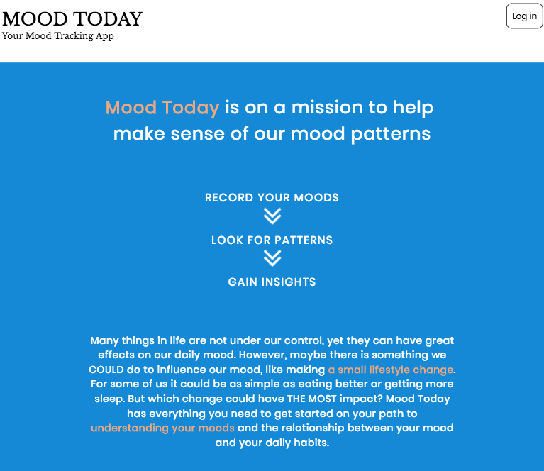

MOOD TODAY

https://laughing-snyder-8c7a23.netlify.com/

### MOOD TODAY is a mood-tracking app. Every day you can rate your mood, along with other factors such as sleep,
healthy eating, and exercise, to build up a database of your mood data over time. You can then review your
mood history as well as see charts and graphs that can help you analyze your data, look for patterns, and gain insights.

### The user can rate their mood on a scale of 1 (bad) to 5 (great). The same scale is used to rate how healthy you ate
and how well you slept. The user can also choose from a list of words to describe their mood (happy, sad, etc). They can also record if they got some exercise. Finally, there is a Notes page to record free-form text about your day. All fields are optional.

### There is a History page where the user can view all of their entries.

### There is a Dashboard page where the user can view charts and graphs based on their accumulated data.

### A user's data can only be accessed via secure login.

### Technology stack

Front-End
+ React
+ Redux
+ HTML
+ CSS
+ JavaScript/JSX

Back-end
+ Node.js
+ Express.js
+ Mongoose
+ MongoDB

Testing
+ Mocha
+ Chai
+ Enzyme

Other
+ Git and Github
+ Netlify
+ Heroku
+ mLab
+ Travis CI
+ Moment.js
+ Victory
+ React-Stepzilla
+ JSON Web Token
+ CORS
